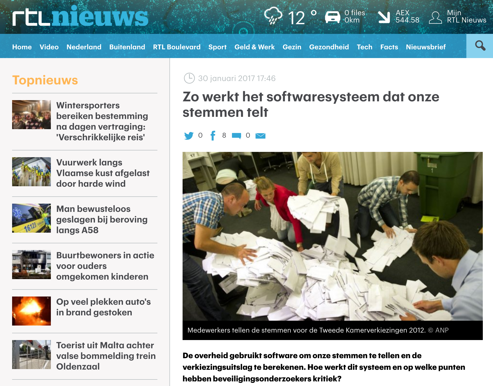

# Don't hack the platform? ☠️💣💥

Jan Ouwens<br/>
2 July 2021

{ style="height:150px;" }
---
# ಠ_ಠ

---

{ style="float:right" height=800px }

<h1>About me 🤓</h1>

Jan Ouwens


 [jqno](https://twitter.com/jqno)

# EqualsVerifier

<br/>

```java
EqualsVerifier.forClass(Foo.class)
              .verify();
```

# About this talk

# {data-background-image="images/accident.jpg"}

# {data-background-image="images/evil.jpg"}

# Things you shouldn't mess with:

- Language 'features'
- Reflection
- Annotations
- External libraries

# Ratings

- ☠️
- ☠️💣
- ☠️💣💥


# ☠️ Language 'features'

# True Lambda

> Demo

# True Lambda

Java 11!

. . .

In fact... Java 17!

# Sidebar

Also annoy your coworkers with

* Using Vim
* Running Java from shell script
* Weird color scheme

---


> Demo

# Generics

> Demo

# Unicode symbols

* Hard to type
* Hard to read
* Rating: ☠️


# False is True

> Demo

# False is True

> Scala demo

# False is True

> Kotlin demo

# False is True

Rating: ☠️💣

# Unicode converter

> Demo

# Unicode escapes

* Harder to type and read
* Maven says ¯\\\_(ツ)\_/¯
* Rating: ☠️💣

# Emoji

> Demo

# Emoji

Rating: 🎉


# Hash-code

> Demo

# Hash-code

* Fun when coworkers insist on hashCode as key
* Rating: ☠️

# Hash-code

However...



# ☠️ Reflection

# Introducing: Reflector


# Loopy

> Demo

# Loopy

Was this hack evil? ✋

. . .

Are Calendars and arrays evil? ✋

. . .

Are JPA entities evil? 👹

# Loopy

Rating: ☠️💣💥


# Interning

> Demo

# Oh man 😒

    WARNING: An illegal reflective access operation has occurred
    WARNING: Illegal reflective access by demos.reflection.Reflector (file:/Users/jqno/w/personal/dont-hack-the-platform-talk/target/classes/) to field java.lang.String.value
    WARNING: Please consider reporting this to the maintainers of demos.reflection.Reflector
    WARNING: Use --illegal-access=warn to enable warnings of further illegal reflective access operations
    WARNING: All illegal access operations will be denied in a future release

. . .

`--add-opens java.base/java.lang=ALL-UNNAMED`

# Interning

* Fun way to mess up unit tests!
* Rating: ☠️💣


# dirty_CLASS

> Demo

# You should probably

* Call `close()` on `URLClassLoader`
* Report compilation errors with `CompilationTask`
* Handle exceptions

. . .

<br/>
¯\\\_(ツ)\_/¯

# Multi-release JAR file

# EqualsVerifier

```java
@Test
public void equalsverifierSucceeds_whenOneOfTheFieldsIsSynthetic() {
    if (!isJava8Available()) {
        return;
    }

    Class<?> java8ClassWithSyntheticField = compile(JAVA_8_CLASS_WITH_SYNTHETIC_FIELD_NAME, JAVA_8_CLASS_WITH_SYNTHETIC_FIELD);
    EqualsVerifier.forClass(java8ClassWithSyntheticField)
            .verify();
}

private static final String JAVA_8_CLASS_WITH_SYNTHETIC_FIELD_NAME = "Java8ClassWithSyntheticField";
private static final String JAVA_8_CLASS_WITH_SYNTHETIC_FIELD =
        "\nimport java.util.Comparator;" +
        "\nimport java.util.Objects;" +
        "\n" +
        "\npublic final class Java8ClassWithSyntheticField {" +
        "\n    private static final Comparator<Java8ClassWithSyntheticField> COMPARATOR =" +
        "\n            (c1, c2) -> 0;   // A lambda is a synthetic class" +
        "\n" +
        "\n    private final String s;" +
        "\n    " +
        "\n    public Java8ClassWithSyntheticField(String s) {" +
        "\n        this.s = s;" +
        "\n    }" +
        "\n    " +
        "\n    @Override" +
        "\n    public boolean equals(Object obj) {" +
        "\n        if (!(obj instanceof Java8ClassWithSyntheticField)) {" +
        "\n            return false;" +
        "\n        }" +
        "\n        return Objects.equals(s, ((Java8ClassWithSyntheticField)obj).s);" +
        "\n    }" +
        "\n    " +
        "\n    @Override" +
        "\n    public int hashCode() {" +
        "\n        return Objects.hash(s);" +
        "\n    }" +
        "\n}";
```

# JavaCompiler

Rating: ☠️💣💥


# ☠️ Annotations

# Lombok 🌶

use annotations

to trick the Java _**compiler**_

into generating bytecode

that does something else

# Spring & Hibernate

use annotations

to trick the Java _**runtime**_

into generating bytecode

that does something else

# {data-background-image="images/boring.jpg"}

<br/><br/><br/><br/><br/>

<h1>Boring</h1>


# ☠️ External libraries

`Objenesis`

# Constructors are tedious

> Demo

# Constructors are tedious

Rating: ☠️


# Singletons

"[An enum] provides an **ironclad guarantee** against multiple instantiation, even in the face of **sophisticated serialization or reflection attacks**. [...] A single-element enum type is often the best way to implement a singleton."

-- Joshua Bloch, Effective Java 2nd Edition

# Singletons

"[An enum] provides an ironclad guarantee against multiple instantiation, even in the face of sophisticated serialization or reflection attacks. [...] A single-element enum type is often the best way to implement a singleton."

-- Joshua Bloch, Effective Java **3rd** Edition

. . .

😇

# Singletons

> Demo

# Singletons

Rating: ☠️💣


# Confusing card game

---

# {data-background-image="images/tarot.jpg"}

# Confusing card game

> Demo

# Confusing card game

Rating:

Java 11: ☠️💣💥<br/>
Java 12+: 🥳

# Confusing card game


# External libraries

`ByteBuddy`

&

`ByteBuddy Agent`

# Disclaimer

Use cases for agents

* there are many
* they're legitimate


# Confusing card game - revisited

> Demo

# Confusing card game - revisited

Rating: ☠️💣💥


# Time Traveling 🕙🕚

> Demo

<br/><br/>
<br/><br/>
Idea shamelessly stolen from<br/> [/TOPdesk/time-transformer-agent](https://github.com/TOPdesk/time-transformer-agent)

# Time Traveling 🕙🕚

* Unit testing legacy code
* Messing up any code
* Rating: ☠️💣💥

# But wait

## There's more

# Victim / Attack

> Demo

<br/><br/>

```
mvn clean package

runjava -r src/main/java/demos/libraries/remote/Attack.java target/dont-hack-the-platform-0.1-SNAPSHOT.jar ???
```

# Victim / Attack

Rating:
<h1>😱😱😱😱😱😱😱😱😱😱😱😱😱😱😱😱😱😱😱😱😱😱😱😱😱😱😱😱😱😱😱😱😱😱😱</h1>

---

# </>

# {data-background-image="images/ribbon.jpg"}

<h1>Awareness</h1>

# Emoji & unicode

* Checkstyle
* SonarQube

# Security manager

> Demo

<br/><br/>

```java
System.setSecurityManager(new SecurityManager());
```

# Security manager


# Security manager

Java 17: Deprecated

. . .

FOR REMOVAL

# Modularisation

    WARNING: An illegal reflective access operation has occurred
    WARNING: Illegal reflective access by demos.reflection.Reflector (file:/Users/jqno/w/personal/dont-hack-the-platform-talk/target/classes/) to field java.lang.String.value
    WARNING: Please consider reporting this to the maintainers of demos.reflection.Reflector
    WARNING: Use --illegal-access=warn to enable warnings of further illegal reflective access operations
    WARNING: All illegal access operations will be denied in a future release

`--illegal-access=deny`

# Just be careful

Who has access to PROD?

# Do try this at home!

Maybe not at work though?

# Questions?

<br/><br/>

slides & code at<br/>
[https://jqno.nl/talks/dont-hack-the-platform/](https://jqno.nl/talks/dont-hack-the-platform/)

I'm at<br/>
 [jqno](https://twitter.com/jqno)

